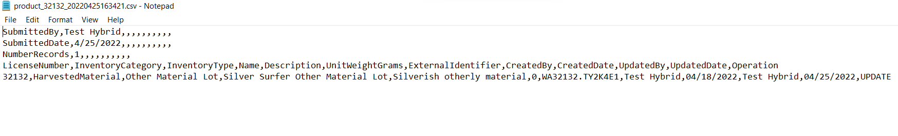
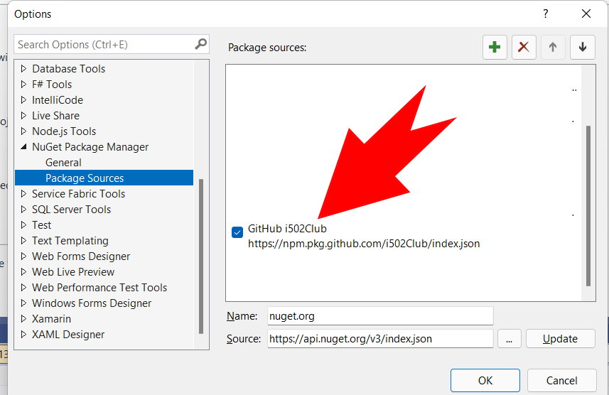

# i502Club.Ccrs
This is a .net class libray project to support WA's CCRS cannabis 
reporting system for use within other .net applications.  The project 
tries to simplify creating the boilerplate code for common models, 
interfaces and enums for sending data to the Cannabis Central 
Reporting System(CCRS).

It is designed/organized so it can be used with the well known 
[CsvHelper](https://github.com/JoshClose/CsvHelper) library which 
enables efficient generation of the files expected by CCRS in WA 
State. 

Example output using test data:

This project is NON OFFICIAL and has not yet been validated for use in a production 
environment.  It is currently being developed and issues are expected to arise requiring 
fixes.

## Getting Started
To get started you must clone the repo to a working directory and begin 
compiling your own version.

To access the package add https://nuget.pkg.github.com/i502Club/index.json as 
a NuGet package source to Visual Studio or any other development tool.

Once you've added the nuget source you can install the package using the 
nuget command found on the package version you're installing(usually latest). 

For most applications it will be the case that you will also want a NuGet 
package reference to CsvHelper.  CCRS is a csv file based system.

The models are intended to work well with CsvHelper to make the file generation process fast 
and easy.  It means the model properties are all in the right order so your CCRS files 
should generate properly by CsvHelper in terms of column placement.

There is great documentation for [CsvHelper](https://joshclose.github.io/CsvHelper/) 
if you need a quick primer on working with it.

This repository includes a test project which demonstrates the generation 
of CCRS files.  The tests show the steps one can use to create and then read 
from a CCRS file using CsvHelper. It also includes some helper funcs and 
custom converters which are useful for some of the common basic steps that are 
likely to arise.

### About the Install
You may also clone the repo or download the source zip available 
on the release page.

### Development
This project will likely see breaking changes.  Please implement accordingly.

There is a known issue related to duplicate inventory type names 
(waste and marijuana mixes) in categories.  This project contains an experimental  
Enumeration Class for Product.InventoryType which attempts to address this 
Enum difficulty but it may be deprecated or require refactoring once a 
standardized solution has been adopted. 

There are also seperate InventoryType Enums representing the category 
specific inventory types available which also avoids duplicate Enum 
Key name collisions that would otherwise occur if using a single Enum. 
It creates difficulties in standard db approaches but workarounds 
can be used with these Enums and depending on your application 
requirements may be useful. (ie. if you are work exclusively with 
plants)

---

*Congratulations*! i502Club.Ccrs is ready to go and you should proceed with creating 
something cool for WA canna.  This files generated by this code base have not yet 
been validated and all information pertaining to CCRS must come directly from the WSLCB 
or their [online resources](https://lcb.wa.gov/ccrs/resources).

---

### Dependencies

 * net frameworks (i502Club.Ccrs)
 * CsvHelper (i502Club.Ccrs.Tests)

## History
This project is used by i502 Club systems for generating in house test CCRS files 
but it has NOT been tested against the actual CCRS system. When validation 
testing proceeds remaining issues that require attention will get addressed.

## Authors
 [i502 Club](https://www.i502.club)

This project was built using [documentation](https://lcb.wa.gov/ccrs/resources) provided for the general public by WSLCB.

## License
This project is licensed under the MIT License - see the [LICENSE.txt](License.txt) file for details

## Acknowledgments
* All the i502 contributors

## Contribute
You can create an issue or submit a pull request to help make the project better.
